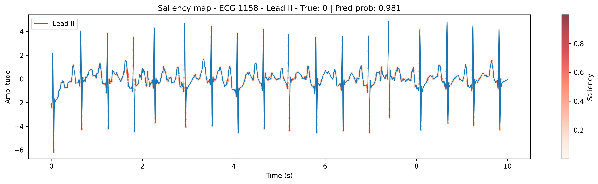

# ECG ST/T Change Classification

An end-to-end deep-learning pipeline for identifying ST/T changes (STTC) from 12-lead ECG recordings using the PTB-XL dataset.

The project combines ECG signal preprocessing, a PyTorch 1D convolutional neural network, held-out test evaluation, gradient-based interpretability, a deployed FastAPI inference service, and a browser-based ECG upload interface.

## Demo

ECG ST/T Change Classification web application
ECG ST/T Change Classification web application

## Live Project

- **Web App:** [Try the ECG classifier](https://bentjones.github.io/ecg_analysis/)
- **API Documentation:** [FastAPI Swagger Docs](https://ecg-analysis-ws6t.onrender.com/docs)
- **API Health Check:** [Render API](https://ecg-analysis-ws6t.onrender.com/health)


## Test Performance


| Metric      | Result |
| ----------- | ------ |
| Accuracy    | 92.04% |
| AUROC       | 0.974  |
| AUPRC       | 0.964  |
| F1          | 0.893  |
| Sensitivity | 90.79% |
| Specificity | 92.76% |


The final model was evaluated on **1,433 held-out PTB-XL ECGs from fold 10**, with zero patient overlap between the training, validation, and test sets.

For the full test-set analysis, including threshold comparison, error analysis, and saliency results, see `[results/TEST_SET_EVALUATION.md](results/TEST_SET_EVALUATION.md)`.

## Classification Target

PTB-XL SCP statements are mapped to their diagnostic superclasses before constructing the binary classification task.

- **Normal (0):** diagnostic superclass is exactly `NORM`
- **STTC (1):** diagnostic superclasses contain `STTC`
- Records that are neither pure `NORM` nor STTC-positive are excluded

STTC-positive ECGs may contain additional diagnostic superclasses alongside `STTC`.

## Pipeline

```text
PTB-XL WFDB recording
        ↓
Diagnostic superclass extraction
        ↓
NORM / STTC dataset selection
        ↓
12-lead ECG loading at 500 Hz
        ↓
Channels-first conversion
        ↓
0.5–40 Hz band-pass filtering
        ↓
Per-lead z-score normalisation
        ↓
1D convolutional neural network
        ↓
Sigmoid STTC probability
        ↓
Validation-selected threshold (0.3773)
        ↓
Normal / STTC classification
        ↓
FastAPI inference service
        ↓
Browser-based web interface
```


## Signal Preprocessing

Raw ECG recordings are read using `wfdb`. The model uses the high-resolution PTB-XL recordings sampled at **500 Hz**, corresponding to **5,000 samples per lead over 10 seconds**.

Preprocessing is implemented in `src/preprocessing.py` and applied in the following order:

1. The signal is transposed from `(samples, leads)` to `(leads, samples)` for PyTorch.
2. A fourth-order Butterworth band-pass filter is applied between **0.5 and 40 Hz**.
3. Each lead is independently z-score normalised using its own mean and standard deviation.
4. Preprocessed signals can be cached as `.npy` arrays to avoid repeating signal processing during training.

The resulting model input has shape:

```text
(12, 5000)
```

representing 12 ECG leads and 5,000 samples per lead.

## Model Architecture

The classifier is a lightweight 1D convolutional neural network implemented in PyTorch.

```text
Input: (12, 5000)
        ↓
Conv1d: 12 → 32, kernel size 7
BatchNorm
ReLU
MaxPool
        ↓
Conv1d: 32 → 64, kernel size 7
BatchNorm
ReLU
MaxPool
        ↓
Conv1d: 64 → 128, kernel size 7
BatchNorm
ReLU
MaxPool
        ↓
Adaptive Average Pooling
        ↓
Dropout (0.3)
        ↓
Linear: 128 → 1
        ↓
Single output logit
```

A sigmoid function converts the output logit into an STTC probability during evaluation and inference.

## Training and Evaluation

The project uses PyTorch `Dataset` classes for both dynamic preprocessing and loading cached preprocessed ECGs.

For the final experiment:


| Split      | PTB-XL Folds |
| ---------- | ------------ |
| Training   | 1–8          |
| Validation | 9            |
| Test       | 10           |


The training pipeline:

- performs mini-batch optimisation on the training set
- evaluates performance on the validation set after each epoch
- records validation loss, accuracy, AUROC, AUPRC, and F1
- saves the model checkpoint with the highest validation AUROC
- implements early stopping based on validation AUROC improvement

The final training configuration used:


| Parameter             | Value               |
| --------------------- | ------------------- |
| Loss                  | `BCEWithLogitsLoss` |
| Positive-class weight | `1.73`              |
| Optimiser             | Adam                |
| Learning rate         | `1e-3`              |
| Weight decay          | `1e-5`              |
| Batch size            | `64`                |
| Best epoch            | `23`                |
| Best validation AUROC | `0.9792`            |


### ROC Curve

Held-out test ROC curve

### Decision Threshold

The final classification threshold was selected using the **validation set**, rather than the test set.

Maximising validation F1 produced a threshold of:

```text
0.3773
```

At this operating point, the held-out test set achieved:


| Metric      | Value  |
| ----------- | ------ |
| Sensitivity | 90.79% |
| Specificity | 92.76% |
| Precision   | 87.76% |
| F1          | 0.8925 |
| AUROC       | 0.9742 |
| AUPRC       | 0.9635 |


## Interpretability

Gradient-based saliency maps are implemented using Captum's `Saliency` method.

For a selected ECG, the gradient of the model output with respect to each input sample is computed. Absolute gradient magnitudes are then normalised for the selected lead and overlaid on the ECG waveform.

This provides a visual indication of waveform regions with high local influence on the model output.

Saliency analysis was performed on extreme test-set errors, including:

- the highest-STTC-probability false positive
- the lowest-STTC-probability false negative
- Lead II
- precordial leads V1–V6

Saliency maps are used as exploratory error-analysis tools and should not be interpreted as causal or clinical explanations of model decisions.

### Example Saliency Map



Example gradient-based saliency map for ECG 1158, a normal-labelled ECG assigned a high STTC probability by the model.

## Web Application and API

The trained model is exposed through a FastAPI inference service deployed on Render.

The `/predict` endpoint accepts paired WFDB files:

```text
record.hea
record.dat
```

The API pipeline:

1. Receives the uploaded WFDB files.
2. Reads the ECG using `wfdb`.
3. Applies the same signal preprocessing used during model development.
4. Performs inference using the trained PyTorch model.
5. Converts the output logit into an STTC probability.
6. Applies the validation-selected decision threshold.
7. Returns the classification and probability as JSON.

Example response:

```json
{
  "prediction": "Normal",
  "sttc_probability": 0.0443
}
```

A lightweight HTML, CSS, and JavaScript frontend is hosted using GitHub Pages. The browser uploads the ECG files to the Render API and displays the returned prediction and STTC probability.

## Repository Structure

```text
ecg_analysis/
│
├── api/
│   ├── main.py
│   ├── predict.py
│   └── test.py
│
├── src/
│   ├── data_extraction.py
│   ├── dataset.py
│   ├── model.py
│   ├── plots.py
│   ├── preprocessing.py
│   ├── saliency_map.py
│   └── training.py
│
├── notebooks/
│   └── data_pipeline.ipynb
│
├── results/
│   ├── metrics/
│   ├── models/
│   ├── plots/
│   └── TEST_SET_EVALUATION.md
│
├── docs/
│   ├── index.html
│   ├── style.css
│   └── app.js
│
└── requirements.txt
```


## Implementation Details


### Data Extraction

`src/data_extraction.py` reads PTB-XL WFDB recordings at either 100 Hz or 500 Hz and maps SCP diagnostic statements to their corresponding diagnostic superclasses.

The binary target retains:

- pure `NORM` records as class `0`
- any record containing the `STTC` superclass as class `1`

Records that are neither pure `NORM` nor STTC-positive are excluded from the binary dataset.

### Dataset Handling

`src/dataset.py` provides two PyTorch dataset implementations:

- `ECGdataset` loads and preprocesses ECGs dynamically
- `CachedECGDataset` loads previously preprocessed `.npy` signals

Caching reduces repeated signal-processing overhead during model training.

### Evaluation

`src/training.py` calculates:

- loss
- accuracy
- AUROC
- AUPRC
- F1
- confusion matrix

Model checkpoints are selected according to validation AUROC.

### Visualisation

`src/plots.py` provides utilities for plotting:

- training and validation loss
- validation AUROC
- validation AUPRC
- validation F1
- individual 12-lead ECG recordings


## Limitations

- Evaluation is currently limited to PTB-XL; external validation on an independent ECG cohort would be required before assessing generalisability beyond this dataset.
- The classifier distinguishes pure normal ECGs from ECGs containing the broad STTC diagnostic superclass rather than individual ST/T pathologies.
- ECGs containing other diagnostic superclasses without STTC are not represented in the binary task.
- The classification threshold was selected using validation data and reflects a trade-off between sensitivity and false-positive rate.
- Gradient-based saliency measures local input sensitivity and does not provide a causal or clinical explanation for a prediction.
- The deployed application is intended as a research and engineering demonstration rather than a clinical diagnostic system.


## Disclaimer

This project is a research and educational prototype.

It has not been clinically validated and is **not intended for diagnosis, treatment decisions, or other clinical use**.